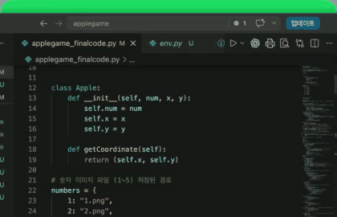

# 🍏 Apple Game Automation (사과 게임 자동화)


> **플래시 게임의 사과 숫자를 인식하고 자동으로 드래그하는 Python 프로그램**  
> `PyAutoGUI`를 활용하여 화면을 분석하고 자동 조작합니다.

---

## **Demo**



[전체 데모 영상 보기](https://raw.githubusercontent.com/Hangyeol82/AppleGame_Marco/main/assets/applegame-demo-small.mp4)

---

## **프로젝트 개요**

플래시 게임에서 **숫자(1~9)를 인식**하고 **자동으로 숫자를 드래그**하는 프로그램입니다.

**기능**
- PyAutoGUI를 사용한 **이미지 인식**
- 숫자의 위치를 감지하여 **2차원 배열에 저장**
- 특정 규칙을 기반으로 **자동 드래그 수행**
- Retina 디스플레이 지원 (MacBook M1/M2/M3 대응)
- 합이 10이 되는 가로, 세로, 사각형 영역 자동 제거

**사용 기술**
- **Python 3.11**
- **PyAutoGUI** (스크린 이미지 인식 & 마우스 자동화)
- **scipy.spatial.distance** (중복된 이미지 제거)

## **해상도 및 디스플레이 설정 주의사항**

이 프로그램은 **PyAutoGUI**를 사용하여 화면에서 특정 숫자 이미지를 감지합니다.  
하지만 **모니터 해상도 및 배율 설정에 따라 인식 정확도가 달라질 수 있습니다.**

**정확한 작동을 위해 확인해야 할 사항**:

1. **모니터 해상도**
   - 프로그램을 실행한 모니터의 **해상도와 이미지가 캡처된 해상도가 다르면 인식이 어려울 수 있습니다.**
   - 만약 이미지가 잘 인식되지 않는다면 **해상도를 조정하거나, 새로운 숫자 이미지를 캡처하여 설정해야 합니다.**

2. **macOS Retina 디스플레이**
   - macOS(M1, M2, M3)에서는 **Retina 디스플레이(HiDPI) 문제로 이미지 좌표와 마우스 좌표 배율이 다를 수 있습니다.**
   ```python
   x, y = pyautogui.locateCenterOnScreen("1.png", confidence=0.8)
   x, y = int(x / 2), int(y / 2)  # Retina 디스플레이 보정
   ```
